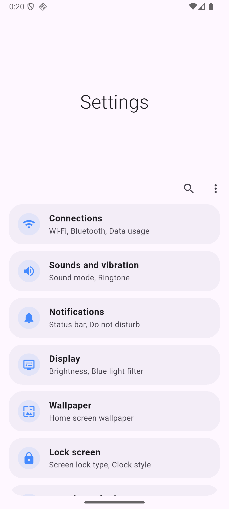
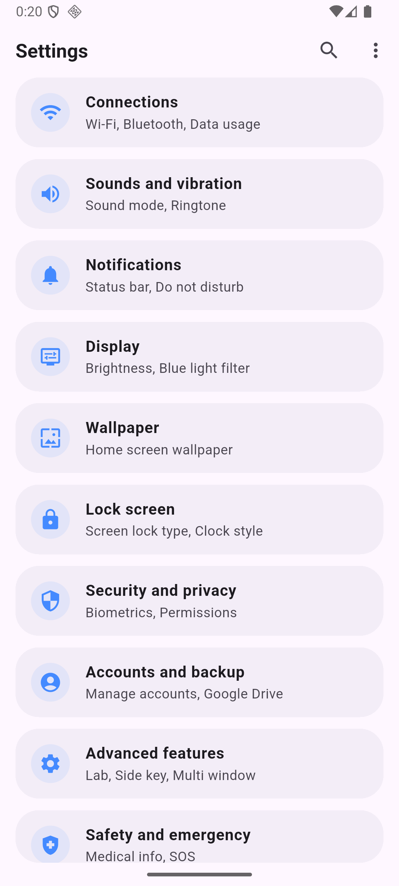
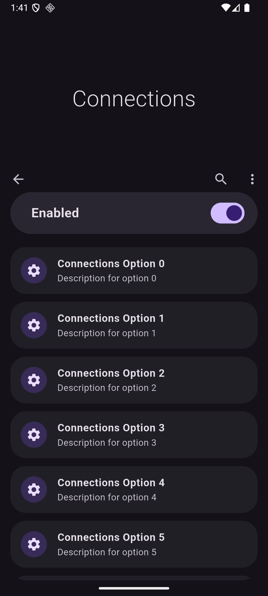
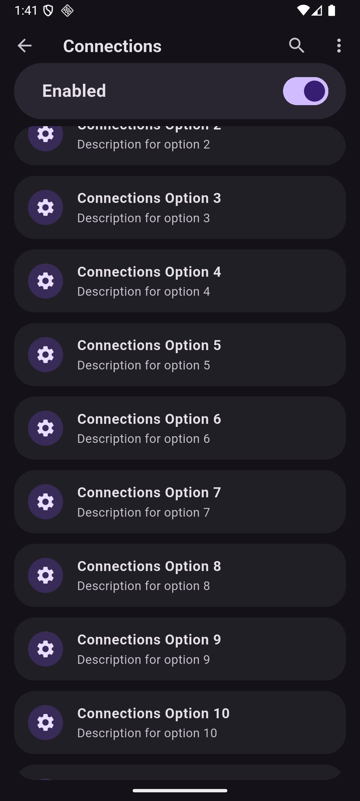

# One UI Scroll View

Implementation of Samsung's One UI signature scrolling behavior in Flutter. Created based on [jja08111/one_ui_scroll_view](https://github.com/jja08111/one_ui_scroll_view)

## Screenshot

<p>
  
  
</p>

<p>

<p>
  
  
</p>

## Features

- **Expanding/Collapsing AppBar**: Smoothly transitions between a large expanded title and a smaller collapsed title as the user scrolls.
- **Snapping Behavior**: The AppBar intelligently snaps to either fully expanded or fully collapsed states.
- **Overscroll Stretch Effect**: Supports an interactive stretch effect when overscrolling at the top.
- **Rounded Mask**: Automatically masks scrolling content with customizable rounded corners.
- **Customizable**: Easy to customize titles, actions, colors, and transitions.

## Usage

Use the `OneUiScaffold` and `OneUiAppBar` just like you would use a standard Flutter Scaffold. Provide your scrollable content in the `slivers` list.

```dart
import 'package:flutter/material.dart';
import 'one_ui_scaffold.dart';
import 'one_ui_scroll_view.dart';

class MySettingsPage extends StatelessWidget {
  @override
  Widget build(BuildContext context) {
    return OneUiScaffold(
      appBar: OneUiAppBar(
        expandedTitle: const Text(
          'Settings',
          style: TextStyle(fontSize: 34, fontWeight: FontWeight.w300),
        ),
        collapsedTitle: const Text(
          'Settings',
          style: TextStyle(fontSize: 20, fontWeight: FontWeight.bold),
        ),
        actions: [
          IconButton(icon: const Icon(Icons.search), onPressed: () {}),
          IconButton(icon: const Icon(Icons.more_vert), onPressed: () {}),
        ],
      ),
      childrenPadding: const EdgeInsets.symmetric(horizontal: 16),
      slivers: [
        SliverToBoxAdapter(
          child: Container(
            height: 1000,
            color: Colors.blue.withOpacity(0.1),
            child: const Center(child: Text('Scroll down...')),
          ),
        ),
      ],
    );
  }
}
```

## Additional Features

- **Stretch Effect**: Enable the overscroll stretch effect by passing `stretch: true` to your `OneUiAppBar`.
- **Custom Bottom Widget**: Add a bottom widget to your `OneUiAppBar` (e.g., switches or tabs) that seamlessly integrates with the scroll behavior.
- **Transitions**: Completely override title transitions via `expandedTitleTransitionBuilder` and `collapsedTitleTransitionBuilder`.

## License

MIT License
